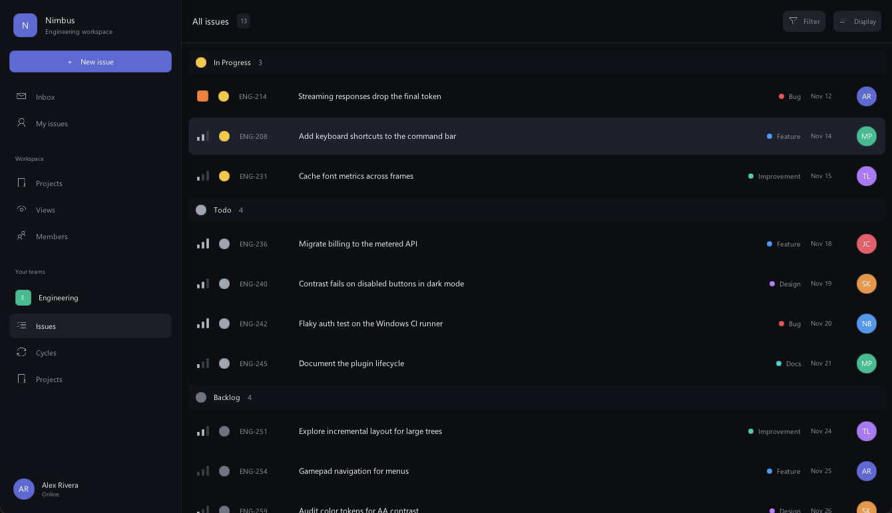
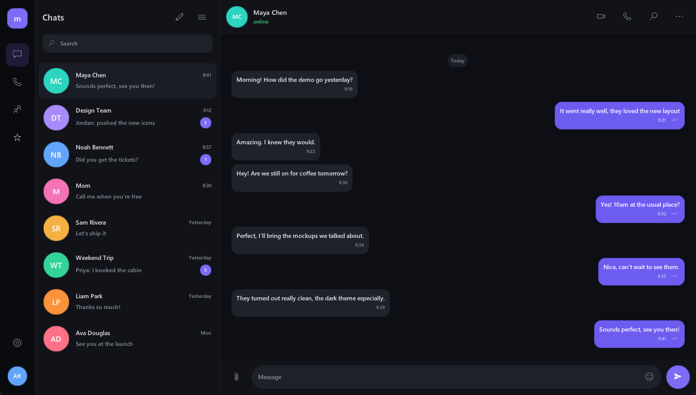
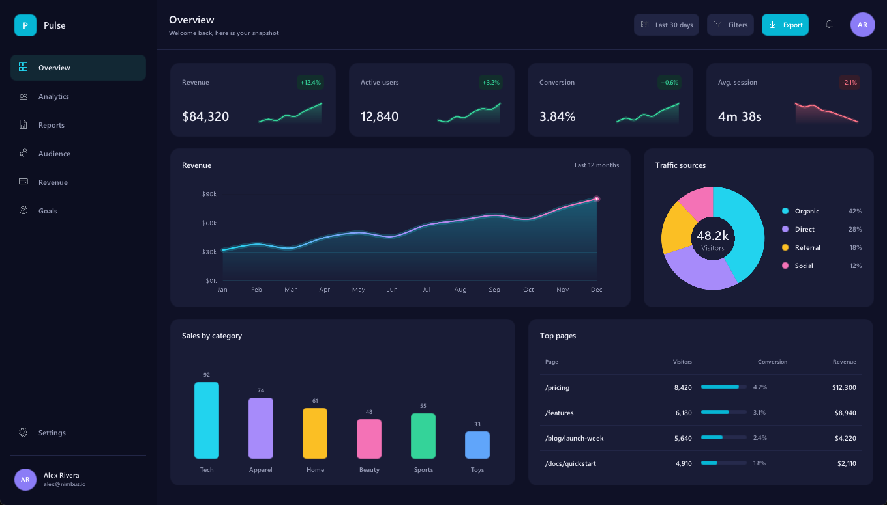
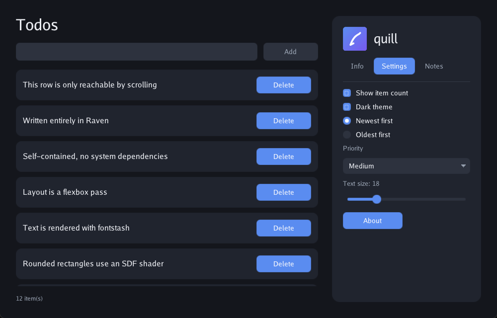

# quill

A GUI toolkit for the [Raven](https://github.com/martian56/raven) language: native
windows, a batched OpenGL renderer, and a declarative, themeable widget set. The
backend (GLFW, OpenGL, fontstash, stb_image) is vendored and statically linked, so
a quill app is a single executable with nothing to install and no DLL to ship.

quill follows the same shape as [plumage](https://github.com/martian56/plumage),
its terminal counterpart. You give it a model and three functions, and it owns the
window, the event loop, and the drawing:

- `init` builds the starting model.
- `update` folds one event into the model. It is the only place state changes.
- `view` returns the interface as a tree of widgets. It is a pure function of the model.

## Built with quill

Apps built with the toolkit. More will land here as we build them.

**A task tracker** (dark theme, sidebar, grouped issue list):



**A chat app** (icon rail, conversation list, message bubbles):



**An analytics dashboard** (KPI tiles, charts, tables):



## Install

Add quill to your `rv.toml`:

```toml
[dependencies]
"github.com/martian56/quill" = "v0.1.0"
```

quill draws text with a font you supply. Point `Font.load` at any `.ttf` on disk;
the examples in this repo use the bundled `assets/fonts/Go-Regular.ttf`.

## Quick start

```raven
import "github.com/martian56/quill" { Font, Theme, WindowConfig }
import "github.com/martian56/quill/widget" { Widget, column, row, label, button }
import "github.com/martian56/quill/app" { UiApp, UiEvent, run_ui }

struct Model {
    count: Int,
    theme: Theme,
}

fun init() -> Model {
    let font = Font.load("assets/Go-Regular.ttf")
    return Model { count: 0, theme: Theme.dark(font) }
}

fun update(m: Model, e: UiEvent) -> Model {
    match e {
        Click(id) -> {
            if id == "inc" {
                return Model { count: m.count + 1, theme: m.theme }
            }
            if id == "dec" {
                return Model { count: m.count - 1, theme: m.theme }
            }
        },
        _ -> {},
    }
    return m
}

fun view(m: Model) -> Widget {
    return column(
        [
            label("count: ${m.count}").size(30),
            row([button("dec", "Minus"), button("inc", "Plus")]).gap(12),
        ],
    ).pad(28).gap(18)
}

fun theme(m: Model) -> Theme {
    return m.theme
}

fun main() {
    run_ui<Model>(
        UiApp {
            init: init,
            update: update,
            view: view,
            theme: theme,
            window: WindowConfig.new().size(480, 320).title("counter"),
        },
    )
}
```

## Concepts

**The loop.** `run_ui` opens the window and drives everything. Each user action
becomes a `UiEvent` passed to `update`; the returned model is passed to `view`,
whose widget tree is laid out and drawn. The loop is event driven, so an idle app
uses no CPU and wakes only when there is something to do.

**State lives in the model.** Widgets carry an `id`, not a callback. A `button("save", "Save")`
produces `Click("save")`; an `input("email", value)` produces `Input("email", newText)`.
`update` matches on the event and returns the next model. This keeps the whole app
state in one value that is easy to reason about, snapshot, and test.

**Theme.** `Theme.dark(font)` and `Theme.light(font)` are palettes of design tokens
(`bg`, `surface`, `field`, `text`, `muted`, `accent`, `on_accent`, `border`) plus the
font. Widgets read the theme, so an app looks consistent with no per-widget styling.
Switching a field in the model and rebuilding the theme flips the whole UI at runtime.

## Widgets

Import these from `github.com/martian56/quill/widget`.

| Builder | Description | Event |
|---------|-------------|-------|
| `label(text)` | Static text | none |
| `button(id, text)` | Clickable button | `Click(id)` |
| `input(id, value)` | Single line text field | `Input(id, value)`, `Submit(id)` on Enter |
| `textarea(id, value)` | Wrapping multi line editor | `Input(id, value)` |
| `checkbox(id, checked, text)` | Labelled checkbox | `Click(id)` |
| `radio(id, selected, text)` | Labelled radio button | `Click(id)` |
| `slider(id, value, lo, hi)` | Draggable slider | `Slide(id, value)` |
| `dropdown(id, selected, options)` | Select menu | `Select(id, option)` |
| `tabs(id, active, labels, theme)` | Tab bar | `Click("id:label")` (read with `tab_of`) |
| `image(handle, w, h)` | An image loaded with `Image.load` | none |
| `divider()` | Horizontal rule | none |
| `column(kids)` / `row(kids)` | Flex containers | layout |
| `panel(child)` | A single child box to fill and round | layout |
| `scroll(id, child)` | Vertically scrollable viewport | layout |
| `modal(base, dialog, dismiss_id)` | Centered dialog over a dimmed backdrop | `Click(dismiss_id)` on the backdrop |

## Modifiers

Every widget is styled by chaining modifiers, each of which returns the widget:

```raven
column([...]).pad(24).gap(16).bg(theme.surface).rounded(16)
```

| Modifier | Effect |
|----------|--------|
| `grow(weight)` | Take a share of leftover space on the main axis |
| `pad(n)` | Inner padding |
| `gap(n)` | Space between children |
| `bg(color)` | Background fill |
| `rounded(r)` | Corner radius |
| `width(px)` / `height(px)` | Fixed size |
| `size(pt)` | Text size |
| `color(c)` | Text color |
| `align(Align)` | Cross axis alignment (`Start`, `Center`, `End`, `Stretch`) |
| `justify(Justify)` | Main axis distribution (`Start`, `Center`, `End`, `Between`) |
| `disabled()` | Grey out and stop responding to input |
| `tip(text)` | Show a tooltip after the cursor rests on the widget |

## Events

`update` receives a `UiEvent`:

| Variant | Meaning |
|---------|---------|
| `Click(id)` | A button, checkbox, radio, or tab was pressed |
| `Input(id, value)` | A field's text changed |
| `Submit(id)` | Enter was pressed in a single line field |
| `Slide(id, value)` | A slider was dragged |
| `Select(id, option)` | A dropdown option was chosen |
| `Tick` | One frame passed with no other input |

Fields support caret editing, Home/End and arrow navigation, mouse selection,
copy, cut, and paste. The text area adds word wrapping, newlines, and up/down
navigation, and scrolls to keep the caret in view.

## Run the examples

```
git clone https://github.com/martian56/quill
cd quill
rvpm run            # the showcase: a todo app touching every widget
rvpm run -- hello   # a smaller counter and text field
```

The bundled showcase exercises every widget in one screen:



## Build, test, format

```
rvpm build          # compile to a native executable
rvpm test           # run the layout, hit-test, and editing unit tests
rvpm fmt            # format the source
```

## How it works

Raven's `extern "C"` is import only: C cannot call back into Raven, which rules
out callback driven windowing. So Raven owns the loop and polls GLFW each frame.

- **Windowing:** GLFW 3.4, vendored into `c/glfw/` and statically linked.
- **Rendering:** a hand written batched OpenGL 3.3 pipeline (`c/render.c`) with
  solid fills, SDF rounded rectangles, glyphs, images, and scissor clipping, one
  draw call per frame.
- **Text:** fontstash and stb_truetype into a glyph atlas (`c/text.c`).
- **Images:** stb_image decodes PNG and JPEG to GL textures (`c/image.c`).

Everything is compiled through Raven's `[ffi] sources`, so there is no separate
build step and no shared library to distribute.

## Project layout

```
quill/
  lib.rv        core API: Window, Frame, Color, Rect, Font, Text, Theme, Image
  widget.rv     the widget tree: builders, modifiers, hit-testing, queries
  layout.rv     the flex measure and arrange passes
  paint.rv      drawing a laid-out tree, text wrapping, overlays
  app.rv        the runtime: UiApp, UiEvent, run_ui
  backend/      the extern bindings over the C shim
  c/            the vendored backend (GLFW, renderer, text, images)
  examples/     hello.rv and the showcase
  assets/       the bundled font and demo image
```

The dependency direction is one way (`app` to `paint` to `layout` to `widget` to
`lib`), since Raven forbids import cycles. Users import widgets from `quill/widget`
and the runtime from `quill/app`.

## Status

The window, renderer, layout, widget set, theming, and input handling are complete
and covered by unit tests plus the showcase. quill runs on Windows today; the
backend is portable (GLFW and OpenGL), and other platforms are planned.

## License

quill is MIT licensed (see `LICENSE`). The bundled Go font is under a BSD 3 clause
license (see `assets/fonts/LICENSE`).
